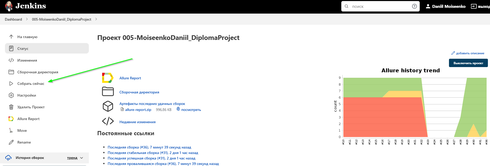
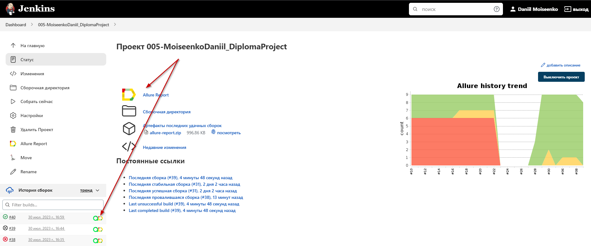
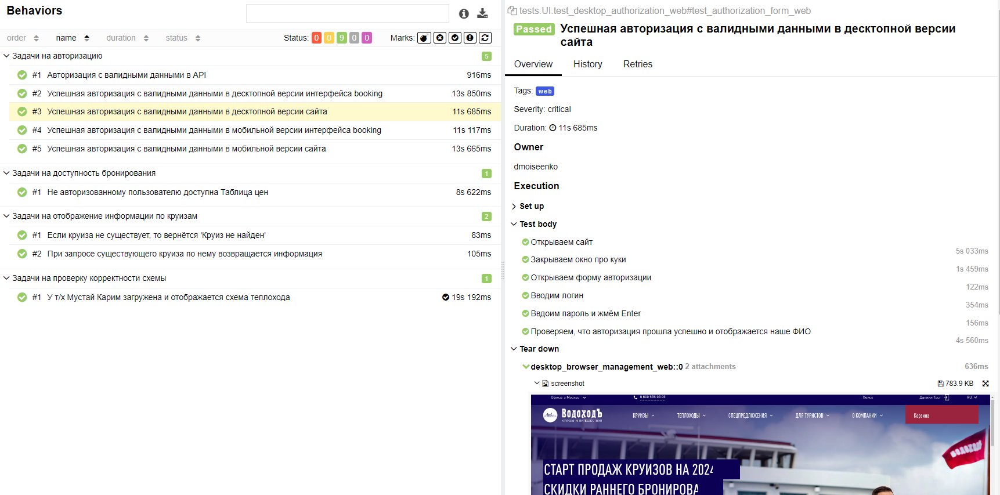
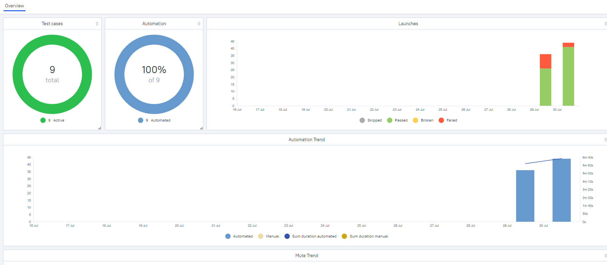
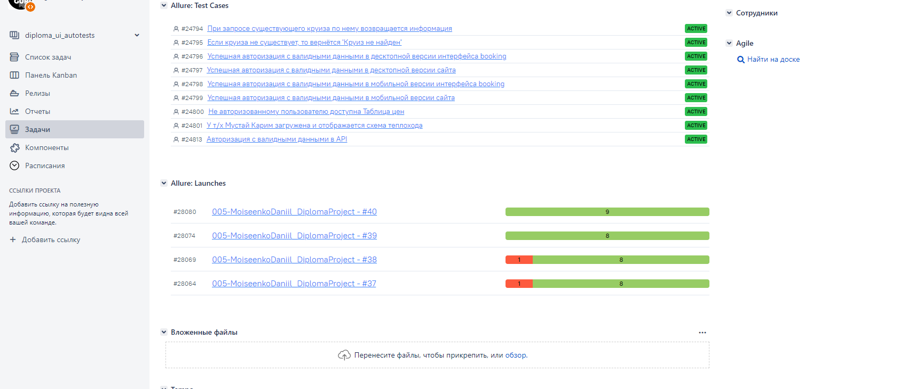

# Пример проекта автотестов для компании ВодоходЪ
> ВодоходЪ - крупнейшая круизная компания и туристический 
> оператор России. Входит в тройку крупнейших компаний
> российского рынка речных круизов,
> на 2018 год охватывавших 80 % пассажиропотока.
> По результатам исследования, проведённого изданием
> Cruise Market Report в 2020 году, компания «Водоходъ»
> занимает первое место в России с 33,8 % долей рынка
> и третье — в Европе. 

### Используемые технологии
<p  align="center">
  <code></code>
  <code></code>
  <code></code>
  <code></code>
  <code></code>
  <code></code>
  <code></code>
  <code></code>
  <code></code>
  <code></code>
  <code></code>
  <code></code>
</p>

## Покрываемый функционал
### UI
- Авторизация в десктопной и мобильной версии браузера
- Авторизация в интерфейсе бронирования booking
- Доступность интерфейса «Таблица цен» для не авторизованных пользователей
- Наличие схемы теплохода у теплохода люксовой категории

### API
- Регистрация и получение токена
- При запросе существующего круиза по нему возвращается информация
- Если круиза не существует, то возвращается 'Круиз не найден'

## Запуск тестов
#### Все UI тесты запускаются удалённо на Selenoid

### Локально
1. Склонируйте репозиторий
2. Откройте проект в PyCharm
3. Введите в териминале команду
``` 
python -m venv .venv
source .venv/bin/activate
pip install -r requirements.txt
pytest .
```

### Запуск тестов в [Jenkins](https://jenkins.autotests.cloud/job/005-MoiseenkoDaniil_DiplomaProject/)
Нажмите кнопку «Собрать сейчас»
<p></p>

###  Отчетность о прохождении тестов в Allure
#### Если тест запускался локально:
Введите в терминале команду 
```
allure serve allure-results
``` 
#### Если тест запускался в Jenkins
Нажмите Allure Report или кликните по иконке отчёта в завершённой сборке
<p></p>

### Примеры отображения тестов



#### Так же в отчетах для каждого UI-теста прикрепляется видео


### Проект интегрирован с Allure TestOps и Jira

